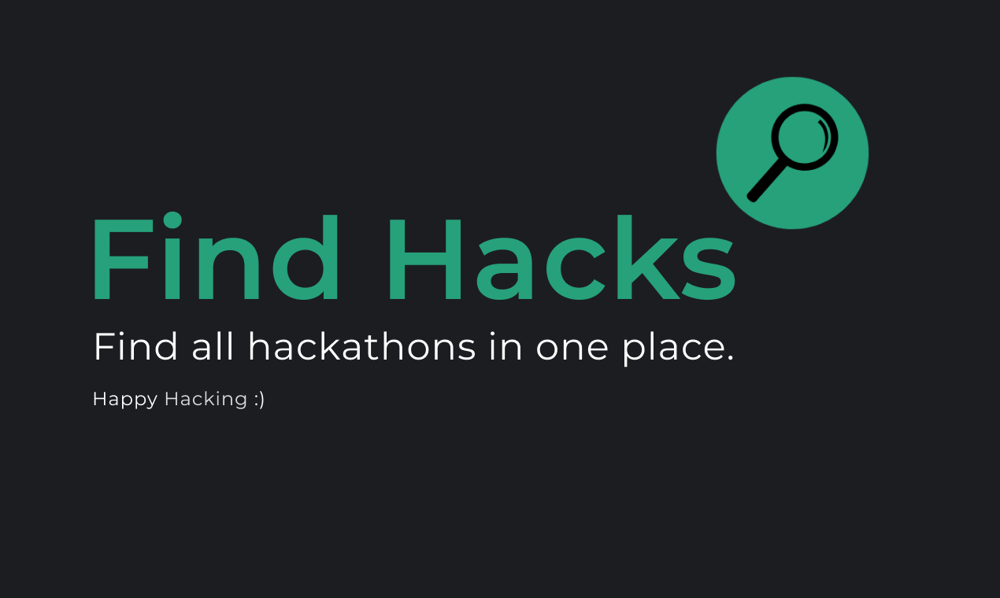

# Find Hacks

An easy way to find hackathons

## Technologies Used

- React.js
- Flask
- Heroku
- Firebase

This is an open source project, feel free to contribute. For any backend related questions reach out to me on https://github.com/zinader

## Frontend Deployment

### `cd client`

### `npm install`

### `npm start`

## Backend Deployment -

### Make sure you have `venv` and `pip` downloaded

### `cd api`

### `python3 -m venv flask`

### `source flask/bin/activate`

### `pip3 install -r requirements.txt`

### `python3 app.py`

## Creators -

- [Pulkit Aggarwal](https://github.com/zinader)
- [Aditya Saxena](https://github.com/aditya2305)
- [Parth Arora](https://github.com/parthx9)

`Please help us optimise this :)`
